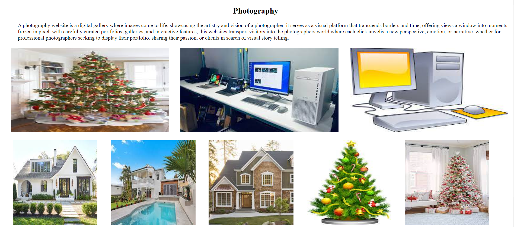
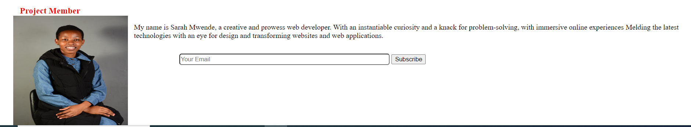

## Photography
This project is a webpage with a list of my favorite photos gallery.


## Technologies Used
This project is build using:
* HTML5
* CSS
* Markdown

## Setup/Running Requirements

In order to run this application you require the following:
* 2GB RAm at-least
* Operating system of your choice

## Setup/Installation Requirements
This section shows you how you can download and run this project on your machine.
* Clone the repository to your local machine by typing the command on your *linux/Macos* `Terminal`. if you are using windows you will need WSL to run this command.
```
git clone https://github.com/SarahKimanzi123/photography-2.git

```
* Navigate into your working directory

```
 cd photography-2

```
* Open the directory in Visual studio code or any text editor of your choice
* Open in Liveserver to see it on the browser.

## Screenshots
             
    
  
  

## Author
* Sarah Kimanzi

## License
This project is under MIT license.